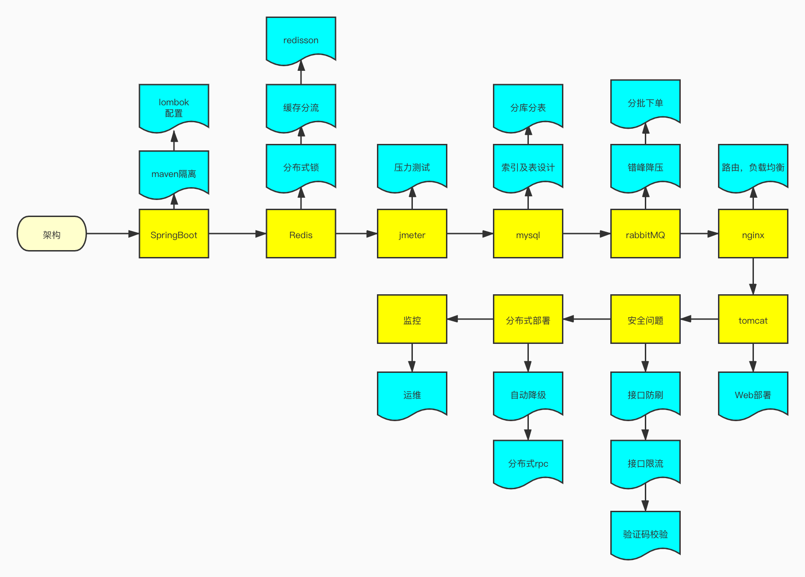

## 简要架构图如上
### SpringBoot
Springboot负责构建整个项目，主要负责maven隔离，lombok配置等。
### Redis
redis主要负责缓存，还可以用来提供分布式锁。
### Jmeter
jmeter用来压测，上线之前需要对系统整体负载有一个大致的水位评估。
### mysql
mysql用来做数据库，配合shardingsphere还可以分库分表。
### rabbitMQ
rabbitMQ消息队列可以错峰降压，分批处理下单。
### ngnix
路由和负载均衡。
### tomcat
web整体部署。
### 安全
需要确保接口防刷和限流，最好能做到验证码校验。
### 分布式部署
支持自动降级和分布式rpc。
### 监控
整体运维，及时发现问题。